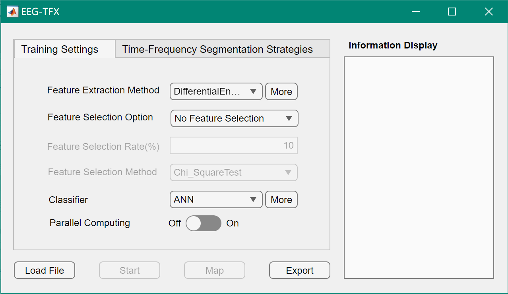
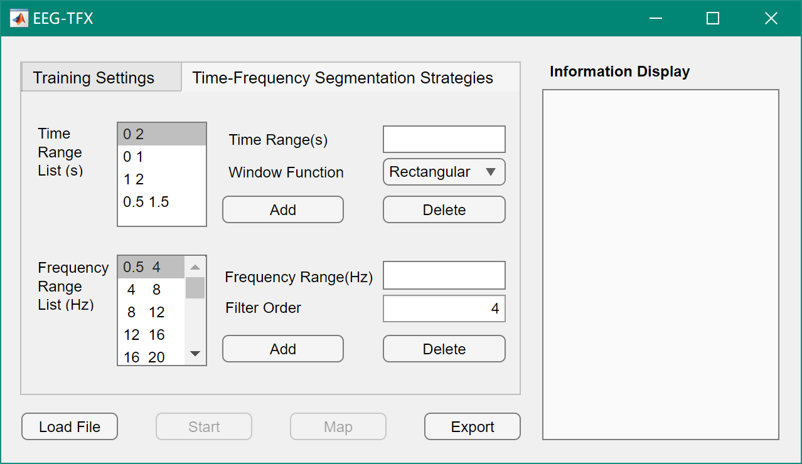
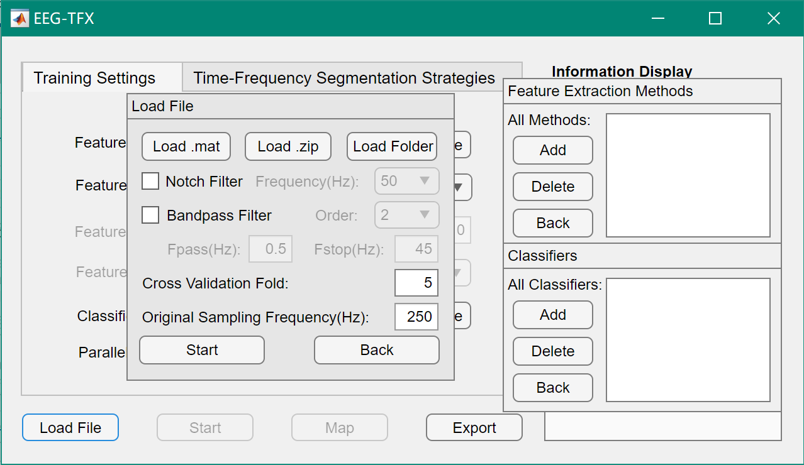

# EEG-TFX:An Interactive MATLAB Toolbox for EEG Feature Engineering via Multi-scale Temporal Windowing and Filter Banks
This work develops a MATLAB-based EEG analysis toolbox, **EEG-TFX**. It is a MATLAB-based software that delivers a comprehensive solution for EEG signal processing and classification. The toolbox features:  
1. An intuitive graphical user interface (GUI) for configuring multi-scale time–frequency segmentation, selecting features and classifiers, performing k-fold cross-validation, and visualizing results in real time.  
2. A built-in post-training pipeline that exports the best-performing model, topographic maps, and accuracy curves for direct deployment and reproducible research.

## Citation

Please cite the tool using this website repository and the manuscript:

## Operating Environments and Dependencies

**System:**
- Windows

**Software & Dependencies:**
- MATLAB R2019a and later releases
- Signal Processing Toolbox
- Statistics and Machine Learning Toolbox
- Parallel Computing Toolbox (optional, if you want to execute the training procedure in parallel, you must install this toolbox).

## Usage

**Step 1: Prepare Your Data**  
Organize your raw EEG recordings in one of three supported formats:

- **Single `.mat` file** – it must contain two variables named `foldData` and `foldLabel`.  
  `foldData` stores the trials as a cell array of 3-D arrays (trials × channels × time points); `foldLabel` stores the corresponding class labels.

- **`.zip` archive** – inside you should have an `EEG/` folder with one `.txt` file per trial (rows = time points, columns = channels) and an Excel file named `table.xlsx` whose first column lists the filenames and second column lists the trial labels.

- **Folder** – place multiple `.mat` files **or** multiple `.zip` files in the same directory (do not mix the two formats).

**Step 2: Launch and Run EEG-TFX**  
Open MATLAB, navigate to the EEG-TFX root folder, and type `EEG_TFX` to start the graphical interface.

- Click **Load File** and pick your `.mat`, `.zip`, or folder.  
- In the preprocessing panel, choose whether to apply a 50 Hz or 60 Hz notch filter, set the band-pass filter order, and confirm the original sampling frequency.  
- Move to the **Time-Frequency Segmentation** tab: add, edit, or remove time windows and frequency bands with the **Add / Delete** buttons.  
- In the **Feature & Classifier** sections, select built-in options or load your own `.m` scripts—new entries appear automatically after a GUI refresh.  
- Press **Start**; a live progress bar tracks feature extraction, selection, model training, and k-fold cross-validation while an accuracy curve updates in real time.  
- When training finishes, all results—per-fold models, the best overall model, EEG topographic maps, and accuracy plots—are automatically saved in the `results` directory for further analysis or publication.

## Corresponding Author
If there is any technical issue, please contact the corresponding author Guoyang Liu: `gyliu@sdu.edu.cn` (please also cc `virter1995@outlook.com`).
Visit [http://guoyang.work/](http://guoyang.work/) for more related works.
